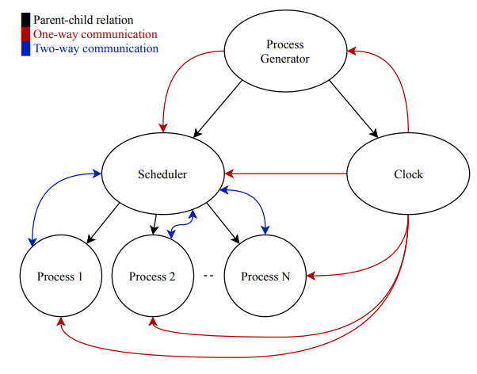
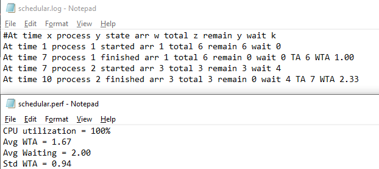
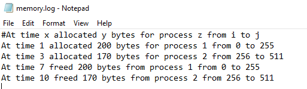
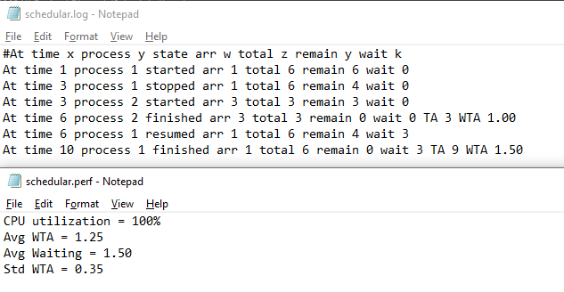
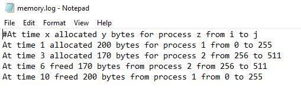
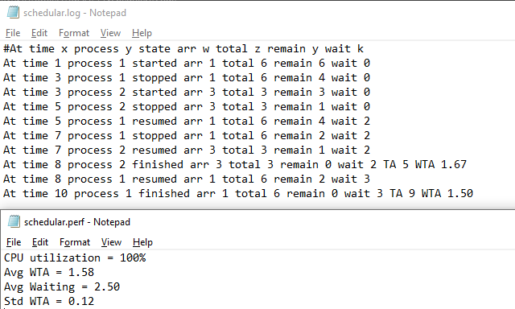
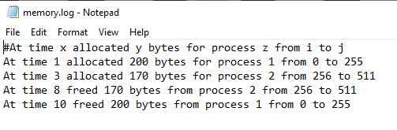

<a href="https://github.com/AdelRizq/mini-OS" rel="noopener">
  
  

<h3 align="center">OS ^ 1/2</h3>

  
  
  
  
  
  
  
  
  
  

## About
> A CPU scheduler determines an order for the execution of its scheduled processes; it
> decides which process will run according to a certain data structure that keeps track
> of the processes in the system and their status.

> A process, upon creation, has one of the three states: Running, Ready, Blocked (doing
> I/O, using other resources than CPU or waiting on unavailable resource).

## System Description

> Consider a Computer with 1-CPU and fixed size memory (1024 ==> can be changed).
> Our scheduler implemented the complementary components as sketched in the following diagrams.

📌 We are supporting the following Scheduling algorithms:
1. HPF (Highest Priority First)
2. STRN (Shortest Time Remaining Next)

## Used Data structures

|     Algo/Part     |       DS       |
|:-----------------:|:--------------:|
|   Processes WTA   |  Linked list   |
|    HPF - SRTN     | Priority queue |
| RR - Waiting list |     Queue      |
|       Buddy       |  Binary tree   |

## Algorithm Flow

- Algo Explanation:
    1. Recieve and process all processes which come in the current second
      1. In case of free space: Allocate space for it and push it in the ready queue
      2. Else: Push it in the waiting list

    2. Check the running process if it finishes or not
      1. True: Free its allocated space and check the waiting list
      2. False: Pass (continue the code flow)
    3. Check if the ready queue is not empty:
       - True: based on the algo, we decide that we will switch or not
    4. Wait till the next second

## Results
1. HPF Algorithm

  

2. SRTN Algorithm

3. Round Robin Algorithm

        
### Contributors
<table>
  <tr>
    <td align="center"><a href="https://github.com/AbdallahHemdan"> <b>Abdallah Hemdan</b></a> </td>
     <td align="center"><a href="https://github.com/AdelRizq"> <b>Adel Mohamed</b></a> </td>
     <td align="center"><a href="https://github.com/ahmedsherif304"> <b>Ahmed Sherif</b></a> </td>
     <td align="center"><a href="https://github.com/Mahboub99"> <b>Ahmed Mahboub</b></a> </td>
  </tr>
 </table>

### Licence
[MIT Licence](https://github.com/AdelRizq/mini-OS/blob/main/LICENSE)
